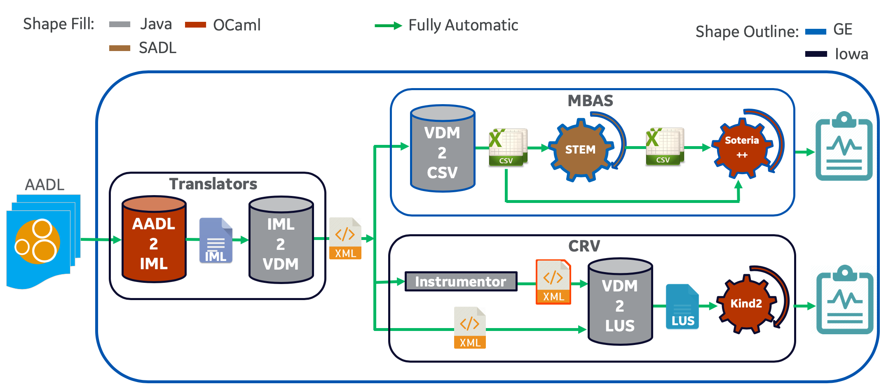

# VERDICT: An OSATE plugin for architectural and behavioral analysis of AADL models

## DARPA Cyber Assured Systems Engineering (CASE) Program

The goal of the DARPA
[CASE](https://www.darpa.mil/program/cyber-assured-systems-engineering)
Program is to develop the necessary design, analysis and verification
tools to allow system engineers to design-in cyber resiliency and
manage tradeoffs as they do other nonfunctional properties when
designing complex embedded computing systems.  Cyber resiliency means
the system is tolerant to cyberattacks in the same way that safety
critical systems are tolerant to random faults—they recover and
continue to execute their mission function.  Achieving this goal
requires research breakthroughs in:

* the elicitation of cyber resiliency requirements before the system
  is built;

* the design and verification of systems when requirements are not
  testable (i.e., when they are expressed in shall not statements);

* tools to automatically adapt software to new non-functional
  requirements; and

* techniques to scale and provide meaningful feedback from analysis
  tools that reside low in the development tool chain.

## VERDICT Workflow

The VERDICT tool is intended to perform analysis of a system at the
architectural level.  Based on the typical workflow shown below, the
VERDICT user will capture an architectural model using AADL that
represents the high-level functional components of the system along
with the data flow between them.  The VERDICT Model Based Architecture
Synthesis (MBAS) back-end tool will analyze the architecture to
identify cyber vulnerabilities and recommend defenses.  The defenses
will typically be recommendations to improve the resiliency of
components, such as control access to and encrypt communications
links, or add components to reduce dependence on a specific source of
information.  For example, add position sensors and voting logic
rather than depend exclusively on a GPS signal to determine location.
Once the architectural analysis is complete, VERDICT supports
refinement of the architecture model with behavioral modeling
information using AGREE.  The VERDICT Cyber Resiliency Verifier (CRV)
back-end tool performs a formal analysis of the updated model with
respect to formal cyber properties to identify vulnerabilities to
cyber threat effects.  This valuable capability provides an additional
depth of analysis of a model that includes behavioral details of the
architectural component models which will help to catch design
mistakes earlier in the development process.  Once the CRV analysis is
complete, the developer will go off and create a detailed
implementation.  The intent of VERDICT Automated Test Generation is to
verify that the implementation is consistent with the architecture and
behavioral models analyzed by VERDICT MBAS and CRV.

## VERDICT's OSATE Plug-in Architecture

The VERDICT tool contains a user interface front-end (an OSATE
plug-in) which runs the VERDICT back-end tools from OSATE's integrated
development environment.  There is a clear separation between the
functionality of the OSATE plug-in and the back-end tools, which also
can be used separately on their own.  The OSATE plug-in simply calls
the back-end tools and informs the user of the results.  The diagram
below shows how the back-end tools are invoked by the plug-in to
perform architectural and behavioral analysis of AADL models.

Distribution Statement A: Approved for Public Release, Distribution Unlimited
