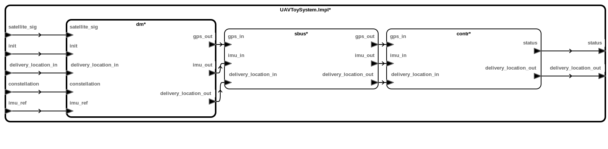
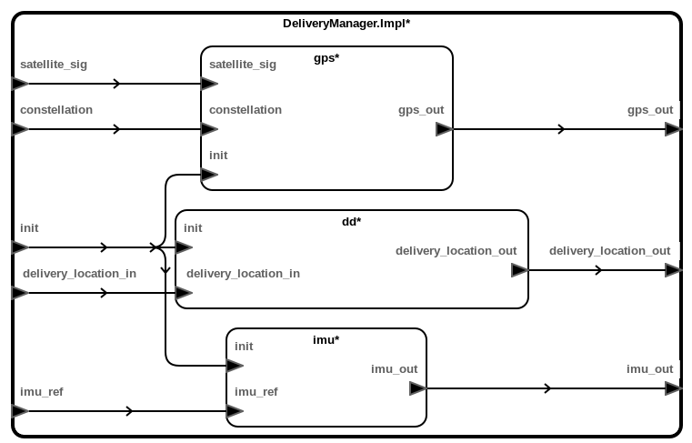

# CASE Toy Model

The CASE Toy model describes a simplified version of a delivery drone with two formal behavioral requirements specified. The UAV system consists in three main components: a DeliveryManager (`dm`), a SystemBus (`sbus`), and a Controller (`contr`). The following figure shows the AADL diagram of the `UAVToySystem`:

The UAV system receives four inputs signals (`satellite_sig`, `init`, `delivery_location_in`, `constellation`, and `imu_ref`), and issues two output signals (`status`, and `delivery_location_out`). The two output signals are not part of the architecture of the actual system. They have been introduced in the model to enable the specification of the two formal properties. To distinguish these two fictitious ports from the actual ones, these ports have the VERDICT property `probe` set to true in the model.

The DeliveryManager is the component responsible of processing the input signals, and transmitting the corresponding signal values to the Controller through the SystemBus. The following figure shows the three components that forms the DeliveryManager, namely, `dd` (a DeliveryDriver), `gps` (a GPS receiver), and `imu` (a IMU device):

In this model the SystemBus works as a pass-through component driven by events. The signal of each data port in the interface of the bus can be present or absent, and it carries a value in the case the signal is present (see data type `PositionEvent.impl` in the AADL model for further details). When an input signal is present, its corresponding output signal is triggered and its associated value is transmitted. Otherwise, the corresponding output signal is absent. The DeliveryDriver waits for the first time the `init` signal is true to issue the `delivery_location_out` signal. When this happens, its value corresponds to the value of the `delivery_location_in` signal. The Controller sets the value of the `status` signal to `Confirmed` as soon as the `delivery_location_in` signal is present, and keeps the same value from then on in the following steps. At that moment, `delivery_location_out` is set to the value of `delivery_location_in` and remains unchanged from then onwards. The rest of signals are not relevant for the satisfaction of the properties of interest.

The two system-level properties we are interested to check are the following:

1. UAV system delivers only if delivery location is the one provided in the initialization.

2. UAV system does not deliver in a bad location.

In order to ensure the satisfaction of the second property in the benign case (when no threat effect model is enabled), the introduction of the following assumption in the contract of `UAVToySystem` is required: the delivery location received by the UAV system during the initialization is never a bad location. Notice that this does not prevent an attacker from breaking the assumption under the appropriate circumstances, it only states what is the expected behavior from the environment  in the benign case (e.g. the values transmitted by the base station).

## Analysis against all threat effect models

After verifying the two formal properties are satisfied by the UAV system in the benign case, the natural step is to check their satisfaction when all the adversarial models are considered (note that activating blame assignment at the link-level for this analysis provides some useful information). A possible outcome of this analysis is that the first property is violated because of a Logic Bomb attack in the DeliveryDriver, and that the second property is violated because of a Network Injection attack in the UAV input signal `delivery_location_in`. To protect the system against the violation of the second property, we can change slightly the architecture of the system and introduce a Runtime Monitor between the SystemBus and the Controller that raises a warning flag when the delivery location is a bad location. This information can be used by the Controller to prevent the status from changing to `Confirmed` when the warning flag is set (the _CASE_Toy_RM_ model implements this defense). Alternatively, we can focus on placing a defense against the Network Injection attack by introducing a trusted Message Authentication Code (MAC) signal which ensures that the delivery location received by the DeliveryDriver has not been compromised (the _CASE_Toy_MAC_ model implements this defense). Notice that a protection based on a MAC relies at the low-level on cryptographic keys to compute the code from the data received and validate it is legitimate. Thus, no trusted signal  is introduced for the MAC in the _actual_ system. However, this representation allow us to
detect possible attacks in the logic of the high-level design by abstracting the low-level implementation with an _ideal_ representation. The use of other analysis tools that take into account the low-level details are necessary to detect attacks against the low-level implementation deployed.

If _CASE_Toy_RM_ model is analyzed against all the threat effect models, we can check that the second property cannot be violated anymore, but the satisfaction of the first one is still vulnerable to either a Network Injection attack or a Logic Bomb attack. If the analysis is repeated over _CASE_Toy_MAC_ model, we can see that both properties can still be violated as a result of a Logic Bomb attack, but they are now resilient against Network Injection attacks. To ensure both properties are satisfied, we need to harden the UAV system by adversarially testing for Trojans and Logic Bombs the DeliveryDriver, and setting the corresponding VERDICT property for the component. The _CASE_Toy_Defenses_ model includes this last defensive measure in addition to the Runtime Monitor and MAC protections, and we can check that when the model is analyzed against all the threat effect models, the system is resilient against all the considered attack effects. 

