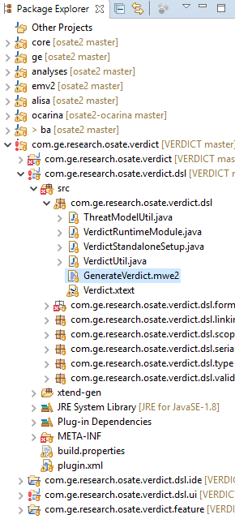

# VERDICT: Building the OSATE plugin

## About OSATE

[OSATE](https://osate.org/about-osate.html) is an Open Source AADL
Tool Environment based on the [Eclipse Modeling
Tools](https://www.eclipse.org/downloads/packages/release/2019-03/r/eclipse-modeling-tools)
package.  The VERDICT tool consists of an OSATE plugin and a set of
VERDICT back-end tools invoked by the plugin.  The OSATE plugin
sources are in this directory and the back-end tool sources are in
another directory [(../verdict-back-ends)](../verdict-back-ends).

## Set up your development environment

Currently our OSATE plugin sources do not have a Maven Tycho build (we
have not written the pom.xml files yet).  You will need to import the
OSATE plugin sources into an OSATE development environment, which is
an Eclipse IDE based on the Eclipse Modeling Tools package, and
manually export the VERDICT plugin into a deployable feature archive.

If you try to build our plugin sources in a regular Eclipse IDE (even
one that can build Eclipse plugins), the Eclipse IDE will not have the
OSATE plugin software development kits.  OSATE does have an [update
site](https://osate-build.sei.cmu.edu/download/osate/stable/latest/updates/)
so you can install the OSATE AADL Tool Environment feature using
Eclipse's Install New Software wizard.  However, you also may have to
install some other target platform requirements such as the Xtext
Complete SDK using Eclipse's Install New Software Wizard to ensure
your Eclipse IDE can build the VERDICT plugin sources.

If you try to build our plugin sources in an OSATE release, the OSATE
release will not have all of the necessary plugin software development
kits.  As with a regular Eclipse IDE, you still will have to identify
and install all the necessary plugin software development kits using
Eclipse's Install New Software wizard to ensure your OSATE release can
build the VERDICT plugin sources.

Therefore, the first step we recommend is to follow the instructions
in [Setting up an OSATE development
environment](https://osate.org/setup-development.html).  Even though
these instructions take longer than using the Install New Software
Wizard, you will be certain to get an Eclipse development environment
that can build the VERDICT plugin sources.

You do not need to build an OSATE release; you simply have to launch
your OSATE development environment and wait for it to get and build
the OSATE sources automatically so that their software will be
available when you build our plugin sources.  You will know you have
successfully launched your OSATE development environment if you see no
errors (only some warnings) in Eclipse's Problems tab after Eclipse
finishes cloning and building the OSATE sources.

## Import our OSATE plugin sources

Once you have launched your OSATE development environment and
successfully imported the OSATE sources without any errors, you can
import our OSATE plugin sources.  We have checked in some Eclipse
project files into source control to make importing the plugin sources
easier to do.  If we had not checked in these Eclipse project files,
you would have to import each source directory one by one using
Eclipse's File > Import... > General > Projects from Folder or Archive
wizard, starting with the com.ge.research.osate.verdict directory and
ending with the com.ge.research.osate.verdict.feature directory.  You
also would have to fix a couple of projects' configuration manually to
ensure some files were generated and included in source paths.
Fortunately, you will not have to do these steps since the Eclipse
project files are in source control.

Start Eclipse's project import wizard using a pulldown menu (File >
Import... > General > Existing Projects into Workspace).  Select this
verdict directory as the folder to import.  The wizard will detect and
list the nested projects inside each subdirectory automatically.
Toggle the checkbox under Working Sets next to Add project to working
sets.  Press the New... button, select Java as the working set type,
type com.ge.research.osate.verdict as the Working set's name, and
press the Finish button to create a new working set.  Press the
wizard's Finish button to start importing the projects as shown in the
screenshot below.

## Build our OSATE plugin sources

You will get many errors in Eclipse's Problems tab once Eclipse builds
the projects after importing them.  This is normal because Eclipse
does not automatically generate some source files that need to be
created for a successful build to be done.  You will need to run the
MWE2 Workflow on the GenerateVerdict.mwe2 file to create these source
files:

1. Expand the com.ge.research.osate.verdict working set in the Package
   Explorer.
2. Expand the com.ge.research.osate.verdict.dsl project.
3. Expand the src folder.
4. Expand the com.ge.research.osate.verdict.dsl project to reveal the
   GenerateVerdict.mwe2 file.

   
5. Right click the GenerateVerdict.mwe2 file and select Run As -> MWE2
   Workflow.
6. When an Errors in Workspace dialog pops up, click the Proceed
   button.

   
7. Wait for Eclipse to rebuild the projects and the errors should go
   away.

## Export our OSATE plugin feature

Start Eclipse's export wizard using a pulldown menu (File >
Export... > Plug-in Development > Deployable features).  Click the
Next button.  Toggle the checkbox next to
"com.ge.research.osate.verdict (1.0.0.qualifier)" in the list of
Deployable features.  Toggle the checkbox next to "Archive file:" and
enter a path where you want the deployable archive to be written to.
Press the Finish button to start exporting our OSATE plugin feature as
shown in the screenshot below.

## Install our OSATE plugin feature

Now that you have a deployable archive, you can install our OSATE
plugin in an OSATE release.  You can find instructions for downloading
and installing the latest stable OSATE release
[here](https://osate.org/download-and-install.html).  You can download
all the necessary VERDICT back-end binaries from this GitHub
repository's
[Releases](https://github.com/ge-high-assurance/VERDICT/releases)
page.  You can find instructions for installing our OSATE plugin
feature and the VERDICT back-end tools in the README within the
com.ge.research.osate.verdict directory; please go
[there](com.ge.research.osate.verdict/README.md) for the complete
list.  What follows is only a brief summary how to actually install
our plugin into an OSATE release.

Start up your OSATE release and open its Install New Software wizard
using a pulldown menu (Help > Install New Software...).  Click the
Add... button in the Install dialog, click the Archive... button in
the Add Repository dialog, select the deployable archive using the
file chooser dialog, and then click the Add button in the Add
Repository dialog and the Finish button in the Install dialog.
Restart OSATE when prompted to do so, although there are more
[steps](com.ge.research.osate.verdict/README.md) you will have to
follow to make the plugin ready for use.
